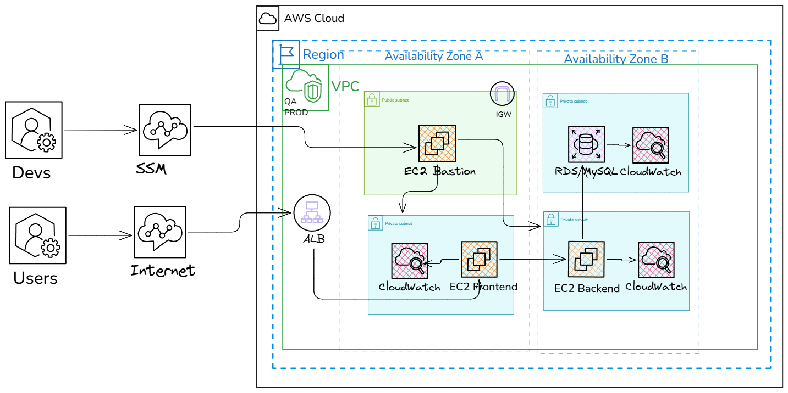

# Movie Analyst Cloud Migration – Terraform + Ansible

## Project Overview

This project migrates the Movie Analyst application to AWS using Infrastructure as Code (Terraform) and Configuration as Code (Ansible). It supports two environments (QA and Production), integrates in-house monitoring via CloudWatch, and follows modular, auditable, and cost-aware design principles.

---

## Architecture Highlights

- Hexagonal application structure: decoupled frontend and backend
- Terraform modules: reusable infrastructure components
- Ansible roles: modular configuration routines
- CloudWatch integration: metrics, logs, and alarms via Free Tier
- Remote state backend: S3 + DynamoDB for collaboration and audit
- Environment isolation: QA and Production via Terraform Workspaces

---



## Folder Structure

```bash
terraform-ansible-aws/
├── devops-rampup/                     # Application source code
│   ├── movie-analyst-api/             # Backend API + database access logic
│   └── movie-analyst-ui/              # Frontend web interface + EJS views
│
├── terraform/                         # Infrastructure as Code (IaC)
│   ├── main.tf                        # Global config + remote backend setup
│   ├── variables.tf                   # Shared variables
│   ├── outputs.tf                     # Shared outputs
│   ├── modules/                       # Reusable infrastructure modules
│   │   ├── network/                   # VPC, subnets, NAT, route tables
│   │   ├── compute/                   # EC2: bastion, frontend, backend
│   │   ├── database/                  # RDS MySQL
│   │   ├── loadbalancer/              # ALB for frontend + backend routing
│   │   ├── iam/                       # IAM roles, policies, instance profiles
│   │   └── security_groups/           # Security groups (SG-to-SG references)
│   ├── environments/                  # QA and Production separation
│   │   ├── qa/                        # QA-specific variables + backend config
│   │   └── prod/                      # Production-specific variables + backend config
│
├── ansible/                           # Configuration automation
│   ├── outputs.json                   # Terraform outputs for dynamic inventory
│   ├── inventory/                     # Static or generated inventory
│   │   └── hosts.ini
│   ├── group_vars/                    # Global variables (RDS credentials, etc.)
│   │   └── all.yml
│   ├── roles/                         # Reusable configuration roles
│   │   ├── bastion/                   # Bastion host setup
│   │   ├── common/                    # Base packages and updates
│   │   ├── frontend/                  # UI configuration
│   │   ├── backend/                   # API configuration + RDS connection
│   │   ├── database/                  # RDS validation
│   │   └── monitoring/                # CloudWatch Agent installation and config
│   ├── playbooks/                     # Main orchestration playbooks
│   │   └── site.yml                   # Full environment configuration
│   ├── scripts/                       # Output parsing and inventory generation
│   │   ├── generate_inventory.sh      # Builds hosts.ini from outputs.json
│   │   └── generate_group_vars.sh     # Builds all.yml from outputs.json
│   └── ansible.cfg                    # Ansible configuration file
│
├── bootstrap/                         # Foundational resources outside Terraform
│   └── infra-bootstrap.yaml           # CloudFormation: S3 + DynamoDB for remote state
│
├── docs/                              # Technical documentation
│   ├── terraform.md                   # Terraform modules + environments
│   ├── ansible.md                     # Role-based configuration + execution flow
│   ├── project-overview.md            # Architecture, dependencies, ports
├   ├── boostrap.md                    # Initial resources for terraform
│   └── README.md                      # Project overview (entry point)

```


## Deployment Workflow

```bash
# Terraform provisioning
cd terraform/environments/qa
terraform init
terraform workspace select qa
terraform apply
terraform output -json > outputs.json
mv outputs.json ../../ansible/

# Ansible configuration
cd ../../ansible/
bash scripts/generate_inventory.sh
bash scripts/generate_group_vars.sh
ansible-playbook -i inventory/hosts.ini playbooks/site.yml
```

---

## Infrastructure Decisions

### Modular Architecture

- Created reusable modules for network, compute, database, loadbalancer, and IAM
- Each module includes governance tags for cost tracking and auditability
- IAM module provisions CloudWatch Agent policy and EC2 instance profile

### Environment Separation

- Used Terraform Workspaces to isolate QA and Production
- Each environment has its own folder under `terraform/environments/`
- Remote state stored in S3 with locking via DynamoDB

### Cost Optimization

- All resources use Free Tier-compatible types (`t3.micro`, `db.t3.micro`, 20 GB storage)
- NAT Gateway used only in QA for private subnet egress
- Load Balancer scoped to backend only

### CloudWatch Integration

- IAM role created for EC2 instances with CloudWatch Agent permissions
- CloudWatch alarms provisioned via Terraform for CPU thresholds
- Agent installation deferred to Ansible for operational flexibility

---

## Configuration Decisions

### Bastion Host Strategy

- Bastion host provisions Ansible if you required SSH keys
- Acts as control node for all configuration routines
- Connects to private subnets via internal IPs
- Optional for SSM

### Role-Based Configuration

- `common`: base packages and updates for all instances
- `frontend`: deploys UI and configures service
- `backend`: deploys API and configures RDS connection via template
- `database`: validates RDS connectivity via `nc`
- `monitoring`: installs and configures CloudWatch Agent

### Dynamic Inventory and Variables

- Terraform outputs exported as `outputs.json`
- Scripts generate `inventory/hosts.ini` and `group_vars/all.yml`
- Ensures alignment between provisioning and configuration

### CloudWatch Agent via Ansible

- Agent installed using official `.deb` package
- Configuration placed via JSON template
- Metrics: CPU, RAM, disk; Logs: `/var/log/syslog`

---

## Validation and Teardown

```bash
terraform workspace select qa
terraform destroy
```

- Removes all provisioned infrastructure while preserving remote state history
- Ansible roles are idempotent and can be re-executed safely

---

## Governance and Audit

- All modules and roles include tagging for cost center, owner, and environment
- Remote state enables versioning and team collaboration
- All decisions documented in this file and reflected in the architecture diagram
